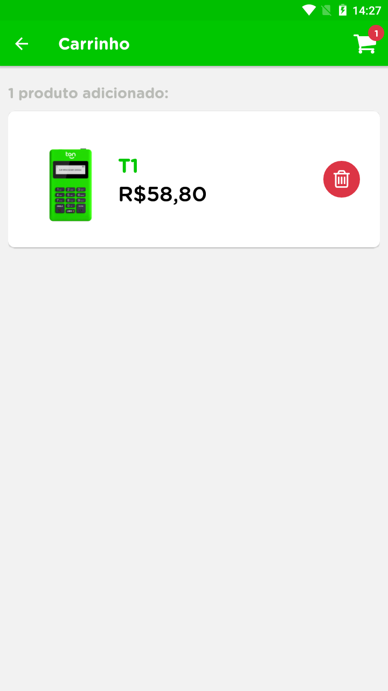
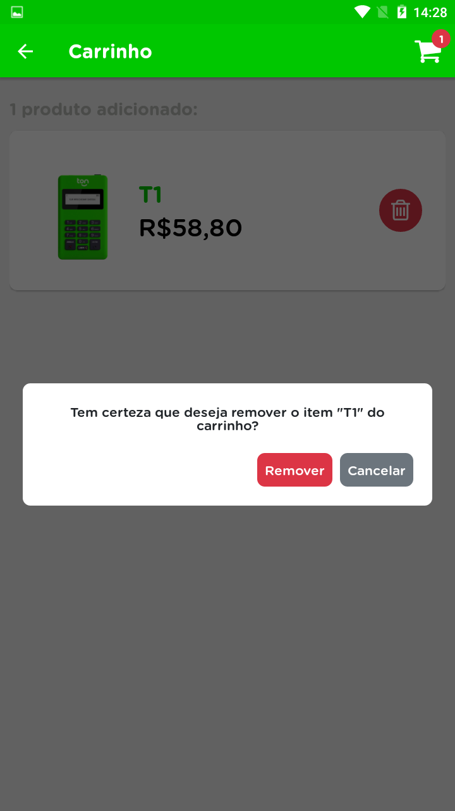

<h1 align="center">
  
<br>
<br>
Teste front-end TON
</h1>

<p align="center">Teste para vaga de front-end no <a href="https://www.ton.com.br/" target="_blank">TON</a>.</p>

<div>
  
  
  
  
</div>

<br/>

# 📋 Índice

- [Sobre o projeto](#-Sobre-o-projeto)
- [Tecnologias utilizadas](#-Tecnologias-utilizadas)
- [Rodando o projeto](#-Rodando-o-projeto)
  - [Pré-requisitos](#-Pre-requisitos)
  - [Rodando o aplicativo](#-Rodando-o-aplicativo)

## 📃 Sobre o projeto

Aplicação desenvolvida para testar conhecimentos de front-end, consiste básicamente em uma aplicação de na qual nos permite salvar itens em um carrinho de compas. A aplicação possui uma tela inicial e uma tela de carrinho, na tela inicial podemos escolher os itens que iremos adicionar ao carrinho e removê-los e na tela do carrinho podemos ver a quantidade de itens adicionados e removê-los.

## 🛠 Tecnologias utilizadas

- ⚛️ **React native** — Aplicativo mobile
- 🚢 **React navigation** — Rotas da aplicação
- 📦 **Redux** — Armazenamento global de estado da aplicação
- 🦉 **React native testing library** — Testes da aplicação
- 😃 **React native vector icons** — Ícones da aplicação

## 🚀 Rodando o projeto

### Pré-requisitos

- <a href="https://git-scm.com/" target="_blank">Git</a>
- <a href="https://react-native.rocketseat.dev/" target="_blank">Ambiente mobile configurado</a>
- <a href="https://yarnpkg.com/" target="_blank">Yarn</a>

### 💻 Rodando o aplicativo

Clone o repositório

```bash

# Clona o repositório

git clone https://github.com/thiagosprestes/ton-frontend-test

```

Navegue até a pasta do projeto clonado e execute o comando abaixo

```bash

# Instala as dependências

yarn

```

Após concluir a instalação das dependências na pasta android que está na raiz do projeto crie um arquivo chamado `local.properties`. Dentro do arquivo adicione o seguinte conteúdo:

```bash

# Caminho para sdk do Android instalada no seu computador

sdk.dir=caminho\\para\\a\\sua\\sdk\\do\\Android

```

Após isso com seu ambiente configurado e emulador aberto execute o seguinte comando para iniciar a aplicação

```bash

# Executa a aplicação

yarn android

```
